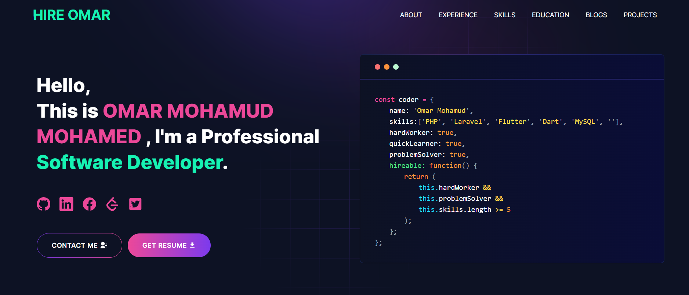

<p align="center" width="100%">
    
</p>

---
# [Built Portfolio With GitHub ](https://github.com/CODEwithZAKI2/myPortfolio)

---

# My Portfolio

### Are you struggling to create a professional portfolio website? Look no further! You can use the Developer Portfolio template and create your very own personalized portfolio today! My website is designed to be user-friendly and easily customizable, making it perfect for both developers and freelancers.

---

# Demo :movie_camera:



## View live preview [here](https://hireomar.netlify.app/).

---

## Table of Contents :scroll:

- [Sections](#sections-bookmark)
- [Demo](#demo-movie_camera)
- [Installation](#installation-arrow_down)
- [Getting Started](#getting-started-dart)
- [Usage](#usage-joystick)
- [Packages Used](#packages-used-package)

---

# Sections :bookmark:

- HERO SECTION
- ABOUT ME
- EXPERIENCE
- SKILLS
- PROJECTS
- EDUCATION
- BLOG
- CONTACTS

---

# Installation :arrow_down:

### You will need to download Git and Node to run this project

- [Git](https://git-scm.com/downloads)
- [Node](https://nodejs.org/en/download/)

#### Make sure you have the latest version of both Git and Node on your computer.

```
node --version
git --version
```

## <br />

# Getting Started :dart:

### Fork and Clone the repo

To Fork the repo click on the fork button at the top right of the page. Once the repo is forked open your terminal and perform the following commands

```
git clone https://github.com/CODEwithZAKI2/myPortfolio.git

cd myPortfolio
```

### Install packages from the root directory

```bash
npm install
# or
yarn install
```

Then, run the development server:

```bash
npm run dev
# or
yarn dev
```

Open [http://localhost:3000](http://localhost:3000) with your browser to see the result.

---

# Usage :joystick:

Goto [emailjs.com](https://www.emailjs.com/) and create a new account for the mail sending. In free trial you will get 200 mail per month. After setup `emailjs` account, Please create a new `.env` file from `.env.example` file.

Eg:

```env
NEXT_PUBLIC_EMAILJS_SERVICE_ID =
NEXT_PUBLIC_EMAILJS_TEMPLATE_ID =
NEXT_PUBLIC_EMAILJS_PUBLIC_KEY =
NEXT_PUBLIC_GTM = # For site analytics
NEXT_PUBLIC_APP_URL = "http://127.0.0.1:3000"
NEXT_PUBLIC_RECAPTCHA_SECRET_KEY = # For captcha verification on contact form
NEXT_PUBLIC_RECAPTCHA_SITE_KEY =
```

### Then, Customize data in the `utils/data` [folder](https://github.com/CODEwithZAKI2/myPortfolio/tree/main/utils/data).

Eg:

```javascript
export const personalData = {
  name: "OMAR MOHAMUD MOHAMED",
  profile: '/profile.jpg',
  designation: "Software Developer",
  description: "My name is OMAR MOHAMUD. Accomplished Software Engineer and Educator with a  Master’s in Electronics and Information Technology, skilled in leading tech-driven initiatives. With over three years of  experience, I am adept at enhancing organizational efficiency and integrating innovative solutions. Proficient in Mandarin, I effectively collaborate in diverse settings, driving both individual and team success. Committed to continuous growth, I aim to meet and exceed business and educational objectives.",
  email: 'cumaraani1887@gmail.com',
  phone: '+252616356021',
  address: 'Mogadishu, Somalia',
  github: 'https://github.com/CODEwithZAKI2',
  facebook: 'https://www.facebook.com/',
  linkedIn: 'https://www.linkedin.com/',
  twitter: 'https://twitter.com/',
  stackOverflow: 'https://stackoverflow.com/',
  leetcode: "https://leetcode.com/",
  devUsername: "codewithzaki2",
  resume: "https://live.taabotech.com/MainCVs2.pdf"
};
```


---

---

# Packages Used :package:

| Used Package List  |
| :----------------: |
|        next        |
|  @emailjs/browser  |
|    lottie-react    |
| react-fast-marquee |
|    react-icons     |
|   react-toastify   |
|        sass        |
|    tailwindcss     |

---
